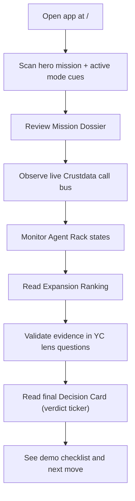

# ExpansionOS User Flow

## Date
- 2026-04-19

## Product intent
ExpansionOS helps a B2B founder turn Crustdata signals into a defendable adjacent-segment pivot decision:
- identify adjacent segment,
- validate the narrowest viable wedge,
- produce an execution-ready recommendation with provenance.

The user flow is built for a live judge demo: visible AI activity, clear evidence, and one final decision card.

## Scope
This flow applies to all routes:
- `/` (Core)
- `/mission-control`
- `/retro-ops`
- `/detective-board`
- `/boardroom`
- `/ai-os`

Each route is a **same-core engine** with a different visual/mode emphasis from [uiux.md](C:/Users/SUHAAN/Desktop/HACKATHONS/ContextCon%20YC/uiux.md).

## Core user journey

## Phase-by-phase behavior

### 1) Entry (0-10s)
- User opens route.
- System shows:
  - Mode rail and active route
  - “ExpansionOS // [mode]” mission header
  - live status indicators (OK / busy / wait)
- Objective for user: understand current operating mode immediately.

### 2) Discovery (10-25s)
- User scans:
  - Mission dossier:
    - ICP
    - target wedge
    - timebox
    - immediate win signal
  - Call bus:
    - packet list with lane + status (queued / fetching / success)
- System behavior:
  - packets auto-advance to simulate AI working
- Objective: prove AI activity is happening.

### 3) Intelligence pass (25-55s)
- User observes agent rack:
  - Each agent card shows identity, role, source, signal, confidence
  - State chips make actionability obvious (`CALL`, `THINK`, `DONE`)
- System behavior:
  - agents reveal output and next move
  - confidence track maps source quality
- Objective: show explainable, role-based decision decomposition.

### 4) Comparison (55-95s)
- User reads expansion ranking:
  - options ordered by overlap + risk + wedge fit + signal
- User reads YC lens:
  - checks narrative/market/ship criteria as a pre-investor review
- Objective: establish defensible decision reasoning before final recommendation.

### 5) Decision (95-120s)
- User lands on verdict ticker:
  - data touched
  - signal quality
  - risks
  - actionable recommendation with proof continuity
- Objective: convert analysis into a pitch-ready action.

### 6) Commit action (2 min+)
- User uses final “NEXT” step from any agent as their launch cue.
- Expected next moves:
  - run proof packet export,
  - build one MVP wedge,
  - define 2-week execution sprint.
- Objective: keep the loop demo-usable and operational, not abstract.

## Route-specific intent overlays

### `/` Core
- Balanced mode.
- Goal: explain the complete loop in one glance.

### `/mission-control`
- Emphasis on prioritization and operations tempo.
- Goal: show command-quality triage with minimal ambiguity.

### `/retro-ops`
- Emphasis on scoring and momentum.
- Goal: create a “run sequence” feel while preserving decision rigor.

### `/detective-board`
- Emphasis on evidence provenance.
- Goal: each output maps back to a source lane.

### `/boardroom`
- Emphasis on investment framing.
- Goal: make “why now + why this wedge + risk + proof” explicit.

### `/ai-os`
- Emphasis on parallel agents and orchestration.
- Goal: show lanes as a coordinated operating system.

## Interaction contract for demo
- User should never need to wait with no feedback.
- Every active operation must have:
  - visual state,
  - textual label,
  - a timestamp or progression indication.
- Every recommendation must map back to:
  - source lane,
  - confidence,
  - next action.

## Success criteria (judge test)
- In under 60 seconds, a judge can answer:
  1) what the AI is doing,
  2) what data it used,
  3) why the recommendation is the wedge,
  4) what to build next.
- If any step fails, flow is broken and must be simplified before demo.

## Proposed next interaction upgrade (phase-2)
- Add one entry control:
  - `Run New Snapshot` button
    - resets call bus and rotates mock data by mode
- Optional:
  - scenario toggle (`Seed company`, `Seed sector`, `Aggressive growth`, `Noisier data`)
  - one-click export of the Verdict Card.
